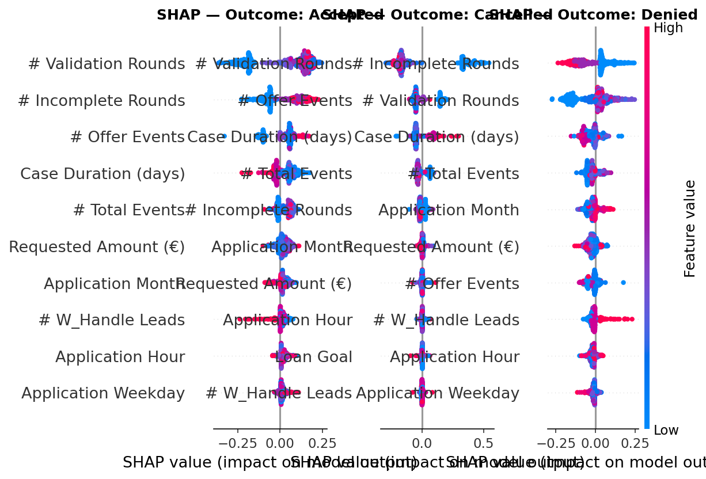
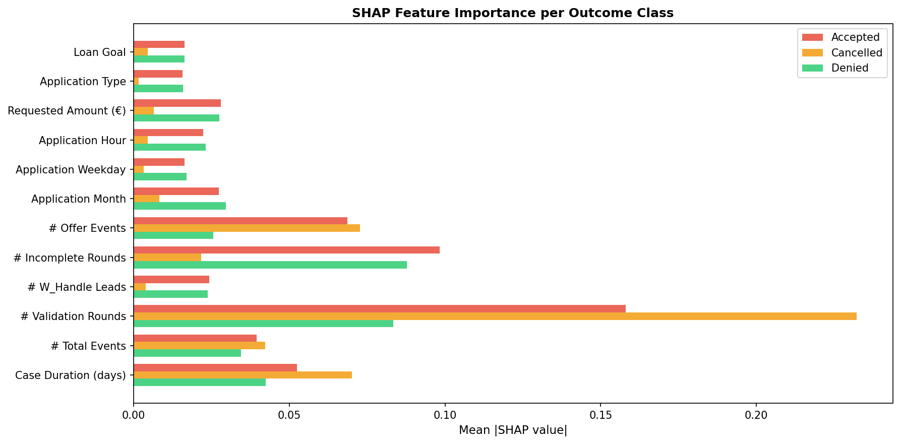
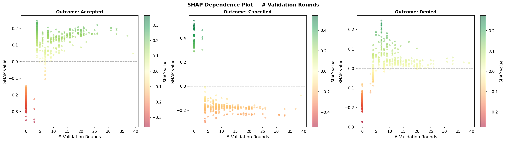
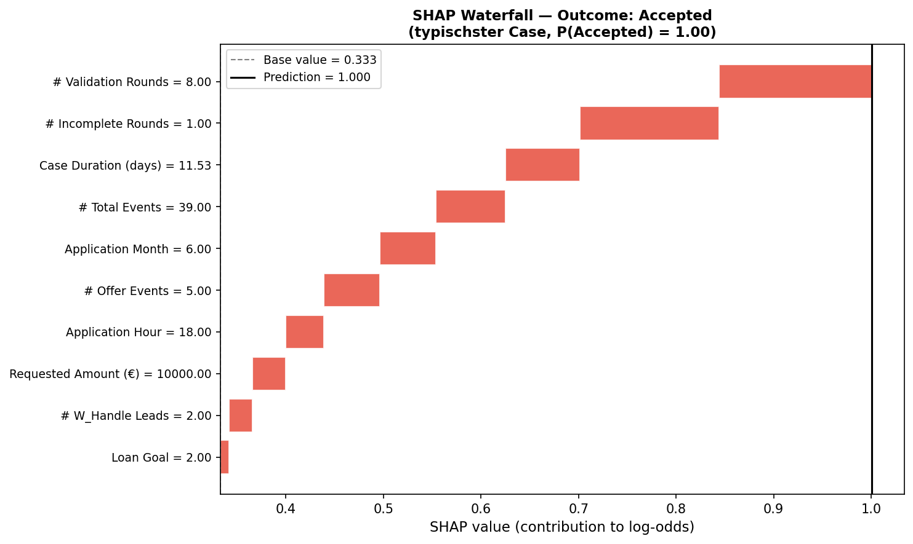
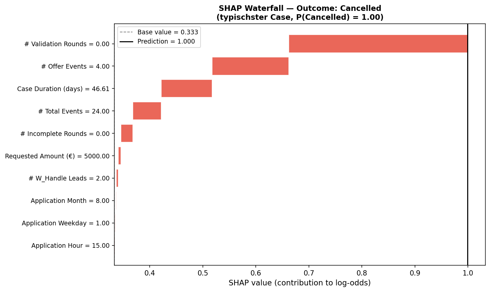
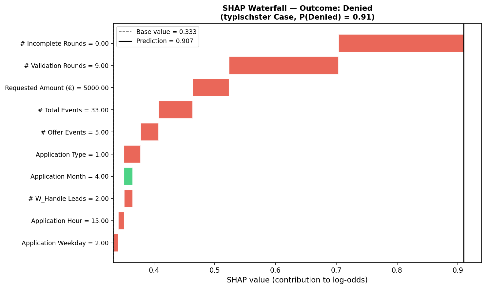
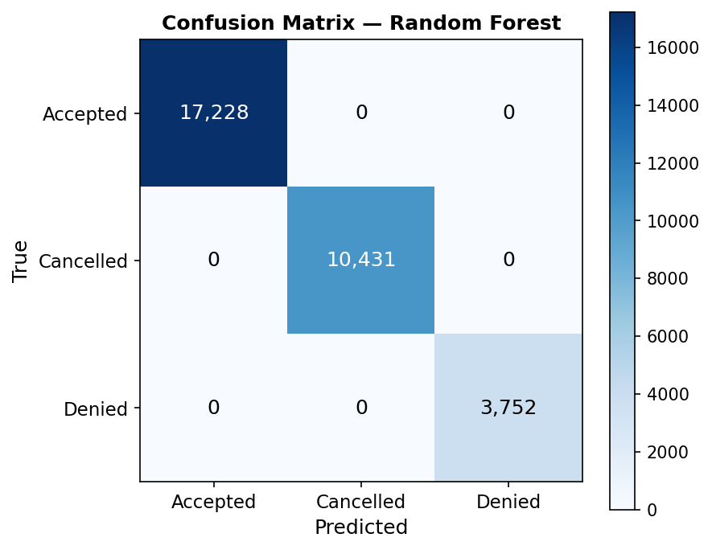
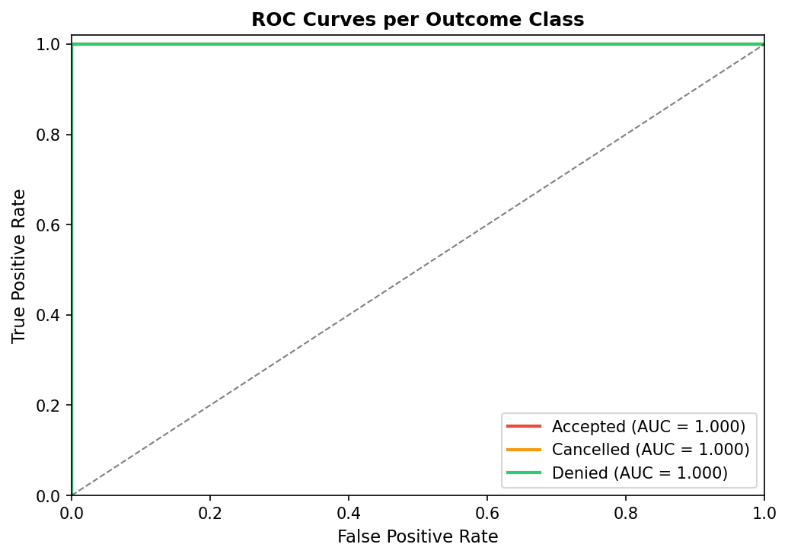

# Advanced Analysis: ML + SHAP — BPIC-17

## 1. Hypothesis

**Research question:** Can the final process outcome (Accepted / Cancelled / Denied) be predicted from attributes known at the start of a loan application, and which attributes drive this prediction?

**Hypothesis:** The requested loan amount and application type are the primary drivers of the final outcome. Cases with very low or very high requested amounts are more likely to be cancelled, while denied cases are driven by a different set of factors.

**Relevance for simulation:** Understanding which input attributes determine the outcome allows a simulation model to route cases realistically. The SHAP values identify which attributes must be modelled stochastically as simulation inputs, and what thresholds trigger different process paths.

## 2. Approach and Results

### Model

A Random Forest Classifier with balanced class weights was trained on case-level and derived process features. SHAP (TreeExplainer) was used to compute feature contributions.

### Features used

- `Loan Goal`
- `Application Type`
- `Requested Amount (€)`
- `Application Hour`
- `Application Weekday`
- `Application Month`
- `# Offer Events`
- `# Incomplete Rounds`
- `# W_Handle Leads`
- `# Validation Rounds`
- `# Total Events`
- `Case Duration (days)`

### Performance

| Metric | Value |
|---|---|
| Baseline (majority class) | 0.548 |
| CV Accuracy (5-fold) | 0.867 ± 0.002 |
| CV F1-macro (5-fold) | 0.733 ± 0.005 |
| Lift over baseline | +0.319 |

### Visualisations

## 3. Interpretation

The SHAP summary plots reveal the global importance of each feature across all three outcome classes. The dependence plot shows how the requested amount influences the prediction — a key threshold effect is expected around €3,000–5,000 separating cancelled from accepted applications.

The waterfall plots explain individual cases: they show how each feature pushes the prediction towards or away from a given outcome, starting from the base rate.

**Implications for simulation:**

- The top SHAP features should be modelled as stochastic input parameters in any simulation model.
- The SHAP threshold on `Requested Amount (€)` gives a data-driven routing rule for the main XOR gateway (A_Cancelled vs. continued processing).
- Features with near-zero SHAP importance can be omitted from the simulation to reduce complexity.
